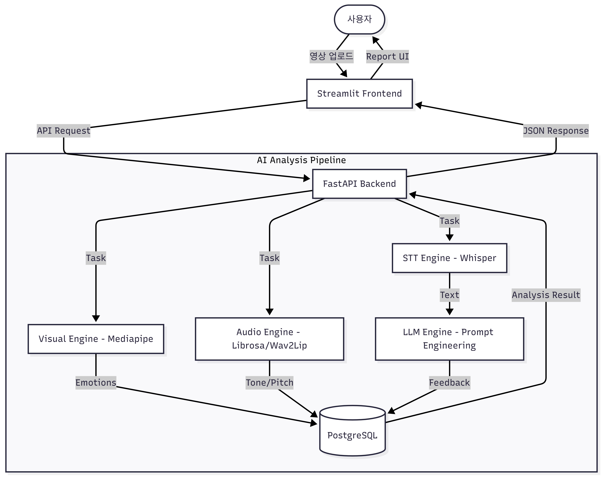

# Triple Synergy: AI 기반 모의면접 솔루션

> **멀티모달(Vision, Audio, NLP) 분석을 통한 심층 면접 코칭 서비스**


## 프로젝트 개요
**Triple Synergy**는 취업 준비생들이 비대면 면접 환경에 대비할 수 있도록 돕는 AI 모의면접 플랫폼입니다.      
사용자의 면접 영상을 분석하여 **표정(Visual), 음성(Voice), 답변 내용(Content)** 세 가지 측면에서 정량적/정성적 피드백을 제공합니다.

## 팀 구성 및 역할 (총 3명)    
| 여의주 | DB 스키마 설계 및 Streamlit 기반 웹 UI 개발     
| 박세진 | 멀티모달 파이프라인 엔진(Vision, Audio, LLM) 구축 및 최적화      
| 임형준 | FastAPI 서버 구축 프론트엔드 & 서비스 

---

## 전체 파이프라인 아키텍처
사용자의 면접 영상이 업로드되면 3가지 분석 엔진이 병렬적으로 작동하며, 최종적으로 LLM이 종합 리포트를 생성합니다.


---

## 기술 스택 (Tech Stack)
- Language: Python 3.11
- AI/ML Core:
  - Visual: Mediapipe (Face Mesh & Expression Analysis)
  - Audio: Librosa, Wav2Lip
  - NLP: OpenAI Whisper (STT), LLM (Feedback Generation)
- Backend: FastAPI, Pydantic
- Frontend: Streamlit
- Database: PostgreSQL
- Environment: Docker

---

## 디렉토리 구조 (Directory Structure)
모듈의 응집도를 높이기 위해 계층형 아키텍처(Layered Architecture)를 채택했습니다.
```
📦 Triple-Project 
├── 📂 app/                     # Backend Core (FastAPI) 
│ ├── 📂 api/                   # API Endpoints (Router) 
│ │ └── v1/                     # API Versioning 
│ ├── 📂 core/                  # Config, DB Connection, Security 
│ ├── 📂 engines/               # AI Analysis Modules (핵심 로직) 
│ │ ├── 📂 visual/              # 표정 분석 (Mediapipe) 
│ │ ├── 📂 voice/               # 음성 분석 (Librosa) 
│ │ ├── 📂 stt/                 # STT (Whisper) 
│ │ └── 📂 llm/                 # 답변 피드백 (LLM)               
│ ├── 📂 repositories/          # DB Access Layer (CRUD) 
│ ├── 📂 schemas/               # Pydantic DTOs 
│ ├── 📂 services/              # Business Logic Layer 
│ └── main.py                   # App Entry Point 
│ ├── 📂 pages/                 # Frontend Pages (Streamlit) 
│ │ ├── 1_🏠_랜딩.py 
│ │ ├── 2_📖_서비스상세.py
│ │ ├── 3_📝_회원가입.py
│ │ ├── 4_🔐_로그인.py
│ │ ├── 5_👤_이력서.py
│ │ ├── 6_📹_면접진행.py 
│ │ └── 7_📊_리포트.py 
│ └── 📂 utils/                 # Shared Utilities 
├── streamlit_app.py            # Frontend Entry Point 
└── requirements.txt            # Dependencies

```
---

## 주요 모듈 상세 설명
### 1. AI Engines (`app/engines/`)
각 AI 모델은 독립적인 모듈로 구성되어 있어, 유지보수와 확장이 용이합니다.
* **Visual Engine**: 프레임 단위로 얼굴 랜드마크를 추출하여 감정(Happy, Nervous, Neutral 등)의 점유율을 계산합니다.
* **LLM Engine**: STT로 변환된 텍스트를 분석하여 'STAR 기법'에 근거한 피드백을 생성합니다.

### 2. Service Layer (`app/services/`)
* **Analysis Service**: 업로드된 영상에 대해 3가지 엔진(Visual, Voice, Content)을 오케스트레이션하고, 결과를 종합하여 리포트 레포지토리에 저장합니다.

### 3. Repository Layer (`app/repositories/`)
* 데이터베이스 접근 로직을 비즈니스 로직과 분리하여 테스트 용이성을 확보했습니다.


---
## 📡 API 명세 (Key Endpoints)

| Method | Endpoint                         | Description |      
| `POST` | `/api/v1/auth/signup`            | 사용자 회원가입 |      
| `POST` | `/api/v1/interview/upload`       | 면접 영상 업로드 및 분석 요청      
| `GET`  | `/api/v1/interview/report/{id}`  | 분석 완료된 상세 리포트 조회 |      
| `POST` | `/api/v1/interview/{id}/analyze` | 특정 답변 재분석 요청 |

---

## 🔄 데이터 흐름 (Data Flow)

1.  **Input**: 사용자가 Streamlit 웹에서 영상 업로드
2.  **Processing**:
    * FastAPI가 영상을 받아 `temp/`에 저장
    * `AnalysisService`가 각 AI Engine 호출
    * Visual/Voice/Content 분석 결과 생성
3.  **Storage**: 분석 결과(JSON + Metrics)를 PostgreSQL에 저장
4.  **Output**: 사용자가 리포트 페이지 접속 시, DB에서 데이터를 조회하여 시각화

---
## 서버 실행 방법 (Docker가 아닌 local vscode 환경에서의 실행)
터미널을 2개 분리하여 실행해주세요

- Backend (FastAPI) 
```bash
uvicorn app.main:app --reload --port 8000
```

- Frontend (Streamlit)
```bash
streamlit run streamlit_app.py
```
- 서비스 접속 : http://localhost:8501
- API 문서 : http://localhost:8000/docs

## License & Notice
본 프로젝트는 **Wav2Lip** 오픈소스를 연구/비상업적 목적으로 활용하였습니다. (Citation: Prajwal, K. R. et al., ACM MM 2020)